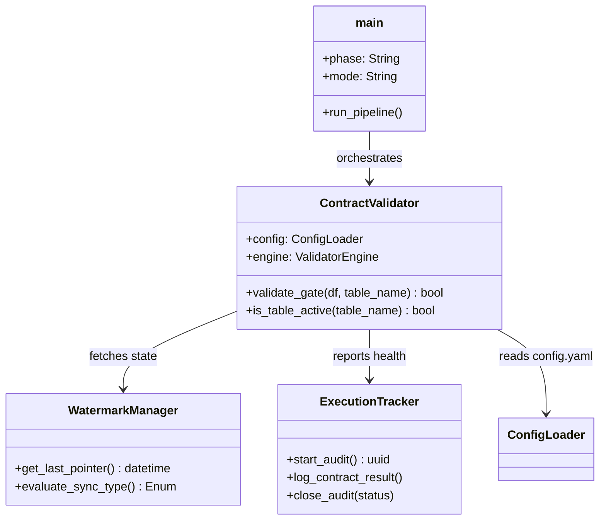

# SPEC: Validación de Contrato de Datos (Stage 2.1)

## 1. RESUMEN TÉCNICO Y TRAZABILIDAD
Este documento traduce los requerimientos funcionales del Stage 2.1 en un diseño de ingeniería modular. El objetivo es implementar un **Guardrail de Datos** que bloquee el pipeline ante inconsistencias estructurales o estadísticas en la tabla `inventario_detallado`.

| Componente | Tag Spec | Requerimiento PRD Vinculado | Función Principal |
| :--- | :--- | :--- | :--- |
| **Validador Core** | `[ARC-12]` | **[REQ-VAL-01]**, **[REQ-STR-01]** | Motor de pruebas de esquema y tipos. |
| **Filtro de Selección** | `[ARC-12.2]` | **[REQ-SELECT-01]** | Lógica de pre-filtrado de fuentes inactivas (`enabled: false`). |
| **Gestor de Integridad** | `[ARC-12.1]` | **[REQ-HAS-01]** | Verificación MD5 local vs Cloud. |
| **Control de Sincronía** | `[ARC-15]` | **[REQ-WAT-01]** | Lógica de Watermarks (FULL/INCREMENTAL). |
| **Trackers de Auditoría** | `[ARC-13]` | **[REQ-OUT-02]**, **[REQ-OUT-03]** | Persistencia en Supabase y Reporte JSON. |
| **Orquestador CLI** | `[ARC-14]` | **[REQ-ARC-15]** | Entrypoint `main.py` con contexto de fase. |

---

## 2. ARQUITECTURA Y DIAGRAMA LÓGICO [ARC-12]

### 2.1. Estructura de Clases (Mermaid)


### 2.2. Arquitectura de Configuración (`config.yaml`) [REQ-CFG-01]
El sistema leerá su contexto operativo de `config.yaml`, estructurado por fases:
*   `system`: Configuración global (project_id, regions).
*   `phases`: Definición de tablas activas por paso (ej: `MVP: [inventario_detallado]`).
*   `outputs`: Nombres de tablas de auditoría (`sys_validation_contract`, `sys_pipeline_execution`).

---

## 3. SPECS DE INGENIERÍA DE DATOS (Pipeline)

### 3.1. Algoritmo de Validación (Pseudocódigo) [SPEC-PIP-01]
```python
0. SETUP: Cargar 'config.yaml' y verificar existencia de tablas en Supabase.
0.1 SELECTION: Para cada tabla, verificar flag 'enabled'. Si es False -> Omitir y Log.
1. AUTH: Conectar a Supabase y obtener 'contract_id' activo.
2. INTEGRITY: MD5(local_yaml) == cloud_hash ? Continue : Abort(FAIL-SECURITY).
3. AUDIT_INIT: Insertar registro 'IN_PROGRESS' en sys_pipeline_execution.
4. WATERMARK: Consultar último 'watermark_end' para determinar tipo (FULL/INC).
5. VALIDATION: Ejecutar suite de pruebas solo sobre fuentes habilitadas.
6. REPORT: Generar reporte JSON y persistir en sys_validation_contract.
7. GATE: validation_status == FAILED ? sys.exit(1) : Continue_Pipeline.
```

### 3.3. Infraestructura Cloud (DDL) [REQ-OUT-02/03]
Se deben ejecutar las sentencias SQL para crear las tablas antes de la ejecución:
*   **`sys_validation_contract`**: Almacena el resultado granular de cada chequeo.
*   **`sys_pipeline_execution`**: Controla el flujo de trabajo global y los watermarks.

### 3.2. Gestión de Sincronización (Watermarks) [ARC-15]
*   **FULL**: Si `sys_pipeline_execution` está vacía o se fuerza vía flag.
*   **INCREMENTAL**: Si `query(max(fecha))` de la fuente > `watermark_end`.
*   **NO_NEW_DATA**: Si `query(max(fecha))` == `watermark_end`. El sistema aborta con estatus `SKIPPED`.

---

## 4. INTEGRACIONES Y PERSISTENCIA (API)

### 4.1. Esquema de Salida: `sys_validation_contract` [REQ-OUT-02]
*   **Clave Subyacente**: `contract_id_ref` (FK a `sys_data_contract`).
*   **Detalle**: Listado serializado de errores específicos por columna.

### 4.2. Esquema de Control: `sys_pipeline_execution` [REQ-OUT-03]
| Campo | Lógica Técnia |
| :--- | :--- |
| `validation_status` | Calculado mediante jerarquía (FAILED > WARNING > SUCCESS). |
| `metadata` | JSON que incluye: `total_rows`, `null_count_per_col`, `execution_latency_ms`. |
| `watermarks` | Almacenamiento de `watermark_start` y `watermark_end` para trazabilidad. |

---

## 5. MLOPS Y DESPLIEGUE (CLI Entrypoint) [ARC-14]

### 5.1. Manejo de Contexto por Fase
El sistema debe ser **State-Aware**. `main.py` inyectará la configuración de la fase (`--phase`) en el `ContractValidator` para que este solo cargue las reglas de severidad correspondientes a ese contexto (ej: `MVP` severidad para nulos = WARNING, `CALENDAR` = FAILED).

---

## 6. MATRIZ DE DISEÑO VS PRD
| Componente Spec | Requerimiento PRD | Estatus |
| :--- | :--- | :--- |
| `IntegrityChecker` | [REQ-HAS-01] | Integrado |
| `WatermarkManager` | [REQ-WAT-01] | Integrado |
| `ExecutionTracker` | [REQ-OUT-03] | Integrado |
| `CLI argparse` | [REQ-ARC-15] | Proyectado |

---
> [!IMPORTANT]
> **Definición de Salida Innegociable**: Ningún proceso fuera de `src/validator.py` tiene permiso de escribir en `sys_pipeline_execution` con el estatus de validación. El validador es el único responsable de esta verdad técnica.
> [!IMPORTANT]
> Esta especificación técnica es la base para la implementación en `src/validator.py` y `main.py`. Cualquier cambio en la lógica de severidad debe reflejarse primero aquí.
